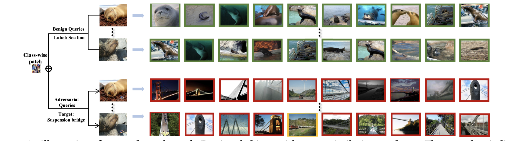

# AdvHash
The implementation of our ACM MM 2021 paper "**AdvHash: Set-to-set Targeted Attack on Deep Hashing with One Single Adversarial Patch**" [[Paper](https://dl.acm.org/doi/pdf/10.1145/3474085.3475396)] [[Poster](images/mm1336-poster.pdf)].

## Abstract

The success of machine learning has brought great research progress for multimedia retrieval. Due to the widely explored adversarial attacks on DNNs, image retrieval system based on deep learning is also susceptible to such vulnerability. Nevertheless, the generalization ability of adversarial noise in the targeted attacks against image retrieval is yet to be explored.

In this paper, we propose AdvHash, the first targeted mismatch attack on deep hashing through adversarial patch. After superimposed with the same adversarial patch, any query image with a chosen label will retrieve a set of irrelevant images with the target label. Concretely, we first formulate a set-to-set problem, where a set of samples are pushed into a predefined clustered area in the Hamming space. Then we obtain a target anchor hash code and transform the attack to a set-to-point optimization. In order to generate a image-agnostic stable adversarial patch for a chosen label more efficiently, we propose a product-based weighted gradient aggregation strategy to dynamically adjust the gradient directions of the patch, by exploiting the Hamming distances between training samples and the target anchor hash code and assigning different weights to discriminatively aggregate gradients. Extensive experiments on benchmark datasets verify that AdvHash is highly effective at attacking two state-of-the-art deep hashing schemes.



## Requirements   

- python 
- torch==1.8.0
- torchvision==0.9.0


## Modules

### Atack Algorithm 

- patch_attack.py : the detailed attack pipeline implementation.

### Model 

- network.py : the DeepHash pytorch  model implemented on ResNet, AlexNet and VGG.
- CSQ.py :  training DeepHash model using CSQ algorithm.
- HashNet.py :  training DeepHash model using HashNet algorithm.

### Utils 

- data_list.py : load images data from ```database.txt```, ```train.txt```and ```test.txt```.
- patch_utils.py : some functions for patch process.
- pre_process.py : data pre-process for images.
- tools.py: necessary tools for training model and attack model.

## Train 

Train model using CSQ  :

```shell 
python CSQ.py
```

Train model using HashNet :

```shell
python HashNet.py
```

Note that, you need to set the parameters in the ```get_config ``` function to specifically train the model you want. The trained models will be saved in the ```save```  directory, denoted as ```model.pt```,  along with the ```.npy``` files of hashcodes and labels w.r.t  images from database set and test set respectively.

The ```xxx.txt ``` files in each subdirectory of ``` data ``` denote the image paths and labels for each dataset respectively. Remember to set the path for each image correctly 


Refer [DeepHash-PyTorch](https://github.com/swuxyj/DeepHash-pytorch) for more training details such as datasets downloads.

## Calculate the anchor codes

You need to sample certain number of hashcode to obtain the anchor code of a certain label. 

Use the ```database_binary.npy``` or  ```test_binary.npy``` and corresponding label  ```database_label.npy``` or ```test_label.npy```  to obtain the anchor codes for all labels, and save them in ```hashcenter.npy```.


## Attack 

Run the following command:

```shell
python patch_attack.py
```

Set the specific parameters with following:

- gpu_id:  the gpu you want to load the model.
- num_iteration: the number of iterations in each mini-batch training.
- noise_percentage: the percentage the patch will cover on original image.
- attack_framework: CSQ or HashNet.
- hash_bit: denotes the hash bit of the model you attack.
- product_threshold: the product threshold.
- alpha: the hyper-parameter $\alpha$ of the tanh($\alpha x $).
- model_type: ResNet50 or VGG16.
- batch_size: the mini-batch size.
- attack_which: set target anchor of which label from ```hashcenter.npy ```.
- source_txt: the path of ```.txt``` file to save the training images.
- test_txt: the path of ```.txt``` file to save the testing images.

Run the following command to realize the attack from label 0 to label 1:  

```shell
python patch_attack.py --attack_which 1 --source_txt attack/source0.txt  --test_txt attack/test0.txt
```

## BibTex
```tex
@inproceedings{hu2021advhash,
  title={AdvHash: Set-to-set Targeted Attack on Deep Hashing with One Single Adversarial Patch},
  author={Hu, Shengshan and Zhang, Yechao and Liu, Xiaogeng and Zhang, Leo Yu and Li, Minghui and Jin, Hai},
  booktitle={Proceedings of the 29th ACM International Conference on Multimedia},
  pages={2335--2343},
  year={2021}
}
```


